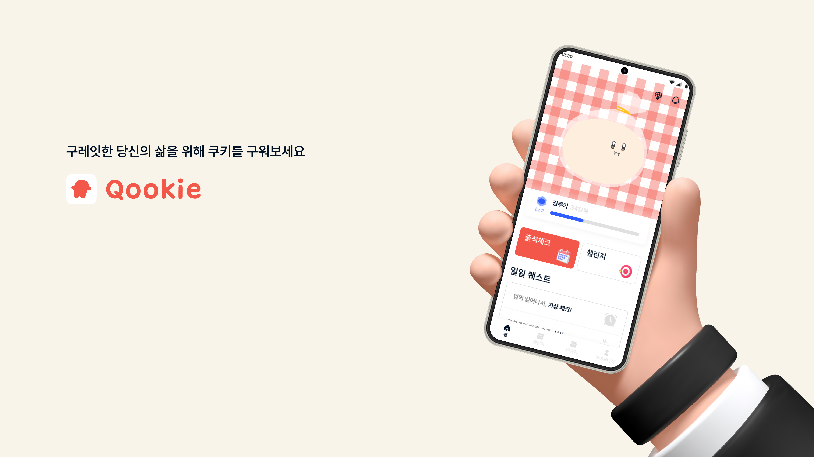
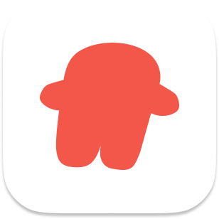
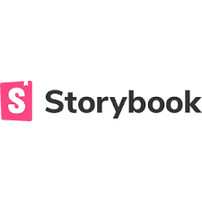
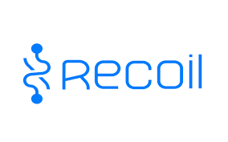
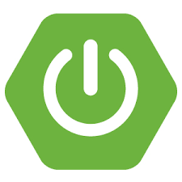
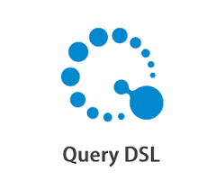
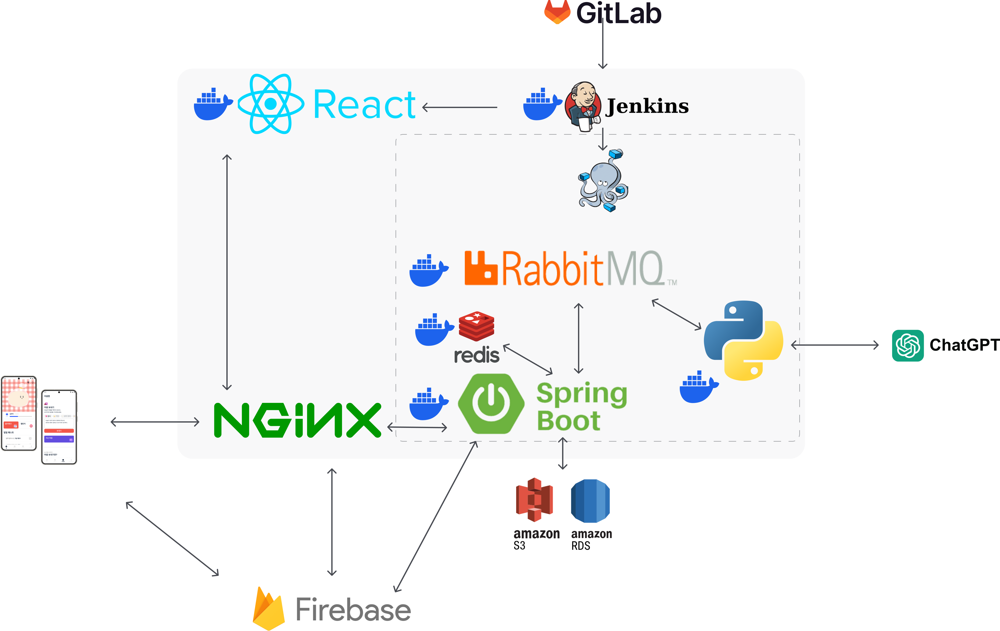
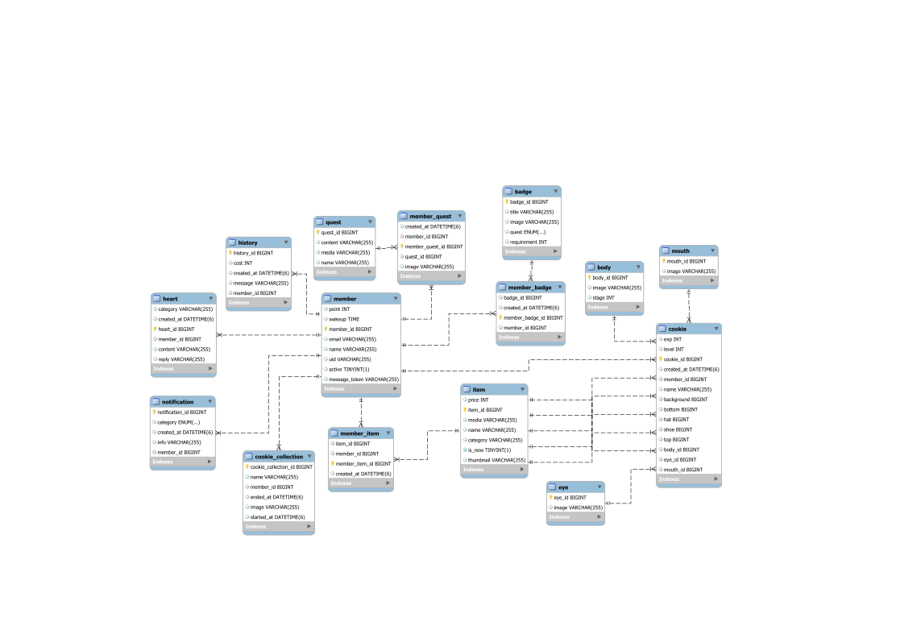

   

  

   

## 개요 

###  Qookie (쿠키)

- 규칙적인 일상 활동 수행 및 마음 건강 관련 퀘스트 해결을 통해 사용자의 육체적, 정신적 건강에 도움주는 웹앱 서비스.
- 꾸준한 사용 및 흥미 유발을 위해 플레이어와 함께하는 캐릭터의 성정, 챌린지를 통한 도전과제 획득, 커스텀을 위한 리워드를 제공합니다.

## 목차
1. [**기획 의도**](#1)
2. [**목표**](#2)
3. [**프로젝트 진행일정**](#3)
4. [**서비스 소개**](#4)
5. [**시스템 구성도**](#5)
6. [**팀원 소개**](#6)

## 📑 기획 의도

<aside>

> 몸과 마음이 지치고 힘든 당신을 위한 서비스, Qookie

</aside>

운동을 하고, 식습관을 개선하는 등 신체적 건강을 위해 노력을 하는 사람들은 많지만, **마음 건강**에 신경을 쓰는 사람들은 상대적으로 많지 않습니다. 지난해 국민건강보험공단의 정신건강 검진에서 우울증 의심 정도가 중간 이상이라고 밝힌 수검자의 수가 43만 명을 넘어섰지만, 한국의 사회적 분위기상 자신의 **마음ㆍ정신적 어려움**에 대해 솔직하게 이야기하는 것이 쉽지만은 않습니다. 그렇기에 우리는 이번 프로젝트를 통해서 마음과 정신적으로 힘든 상황에 처해 있는 사람들에게 조금이나마 도움과 위로가 되기를 바라며 기획하였습니다.

## 🚩 목표

### 기능 관점

1. 사용자의 육체적, 정신적 건강을 증진시키기 위하여 다양한 퀘스트와 도전과제로 흥미 유도
2. 쿠키라는 아바타를 육성하면서 자신과 함께 성장하는 구조
3. 퀘스트를 수행하며 얻는 재화로 쿠키를 꾸밀 수 있는 다양한 아이템을 구매해 커스터마이징 하고, 배지를 수집하면서 성취감 극대화
4. 자신의 기분을 작성하면 심리학 이론이 적용된 GPT로부터 공감과 위로의 답장을 받아 사용자에게 심리적 안정을 줌

### 기술 관점

1. 프롬프트 엔지니어링 통해 GPT가 심리학 이론을 적용한 답변을 하도록 구성
2. 주 백엔드 서버(스프링 부트)와 GPT와의 통신을 위한 파이썬 스크립트를 분리
3. RabbitMQ를 통해 둘을 연결하여 GPT의 응답 지연 시간으로 인한 서버 자원 소모 문제 해결

 

## 📆 프로젝트 진행일정

### 23.10.10 ~ 23.11.17

- 기획 및 설계 : 23.10.10 ~ 23.10.13
- 프로젝트 개발 : 23.10.14 ~ 23.11.10
- 버그 수정 및 산출물 정리 : 23.11.11 ~ 23.11.17

 

## 📚 서비스 소개

### 와이어프레임

### 주요기능

**✅ 퀘스트 수행**

- 일일 퀘스트를 수행함으로써 소량의 재화 획득과 챌린지 달성 요건 충족.
- 기상 체크, 식사, 산책, 스쿼트, 약속, 사진 찍기, 스트레칭, 명상, 물마시기

**✅ 챌린지 수행**

- 월간 챌린지
    - 월간 챌린지를 수행함으로써 많은 재화 획득.
- 뱃지 챌린지
    - 3단계로 구성된 뱃지 챌린지를 수행함으로써 뱃지 및 소량의 재화 획득.

**✅ 마음함**

- 자신의 오늘 하루 감정을 담은 메시지를 작성해서 마음을 보냄.
- 보낸 마음에 대해 심리학 전문가가 프롬프트 엔지니어링 한 chatGPT가 답장 해줌.
- 사용자는 답장을 읽고 위로와 공감을 얻을 수 있음.

**✅ 상점/옷장**

- 퀘스트, 챌린지를 달성함으로써 얻은 재화로 원하는 배경, 의상, 악세서리를 구매/착용해 자신의 쿠키를 꾸밀 수 있음.

### 세부 기능

**☑️ 쿠키 굽기**

- 최고 레벨을 달성한 쿠키는 구워서 컬렉션(내가 만든 쿠키)에 보관하고, 새로운 쿠키를 키울 수 있음.

**☑️ 알림**

- 각종 알림, 공지사항에 대한 알림.

**☑️ 캘린더**

- 퀘스트를 수행한 날을 되돌아 볼 수 있음.

 

## 🛠️ 기술 스택

### Frontend
|React|TypeScript|Storybook|Recoil|StyledComponent|
|:--------:|:--------:|:--------:|:--------:|:--------:|
|  |  |  |  |  | 

### Backend
|Java|SpringBoot|Spring Data JPA|Spring Security|QueryDSL|Python|AWS RDS|AWS S3|Redis|Firebase|
|:--------:|:--------:|:--------:|:--------:|:--------:|:--------:|:--------:|:--------:|:--------:|:--------:|
|  |  |  |  |  |  |  |  |  |  |

### CI/CD
|Nginx|Docke|Jenkins|
|:--------:|:--------:|:--------:|
|  |  |  |

 

## 🗂️ 시스템 구성도

- ### 시스템 아키텍처
    

- ### ERD
    

 

## 👪 팀원 소개

<table>
    <tr>
        <td height="140px" align="center"> <a href="https://github.com/dev-bleck">
                👑 이현복  (Front-End) </a>  </td>
        <td height="140px" align="center"> <a href="https://github.com/Gunbros">
                🙂 이국신  (Front-End) </a>  </td>
        <td height="140px" align="center"> <a href="https://github.com/twoju">
                🙄 조원주  (Front-End) </a>  </td>
        <td height="140px" align="center"> <a href="https://github.com/hun23">
                😆 김동훈  (Front-End, Back-End, CI/CD) </a>  </td>
        <td height="140px" align="center"> <a href="https://github.com/yoon-yoo-tak">
                😶 윤유탁  (Back-End) </a>  </td>
        <td height="140px" align="center"> <a href="https://github.com/bincan98">
                😁 김영서  (Back-End) </a>  </td>
    </tr>
</table>

 

# 🚀 [팀 공유 문서 Notion](https://www.notion.so/971021/A504-4a6d586b359e49f9a73ffb5214335c1c?pvs=4)

 
